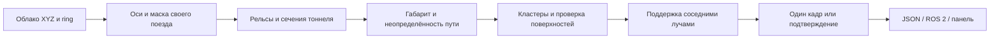

# METRO — обнаружение препятствий по 3D LiDAR

**METRO** — готовое к запуску приложение для обработки лидарных данных, обнаружения объектов в расчётном габарите поезда и визуального анализа результатов. Проект объединяет геометрический алгоритм, интеграцию с ROS 2 Humble, Docker-контейнер и web-панель.

Версия **0.4.2**.

На вход поступает одно облако или поток `sensor_msgs/msg/PointCloud2`. Выход: наличие тревоги, расстояние от лидара, состояние надёжности, геометрия кандидатов и диагностические данные. Для детекции не нужны карта, одометрия, камера, GPU или обученные веса.

## Быстрые ссылки

- [Запуск для проверяющих](START_HERE.md)
- [Полная инструкция: файлы, bag, живой LiDAR и панель](QUICKSTART.md)
- [Архитектура и алгоритм](docs/ARCHITECTURE.md)
- [Формат выходных данных](docs/OUTPUT.md)
- [Отчёт технических проверок](reports/RELEASE_VALIDATION.md)
- [Как загрузить проект на GitHub](docs/GITHUB.md)
- [Сторонние компоненты](THIRD_PARTY_NOTICES.md)

## Что умеет проект

| Возможность | Реализация |
|---|---|
| Один кадр | PCD, PLY, XYZ, CSV или PointCloud2 |
| Запись ROS 2 | SQLite3/MCAP bag, автоматический выбор единственного PointCloud2-топика |
| Живой источник | ROS 2 PointCloud2, локальный HTTP-приём облаков |
| Результат | `obstacle`, `distance_m`, `status`, рамки, точки, причины неопределённости |
| Режимы | Один кадр или подтверждение 2 попаданий из 3 кадров |
| Габарит | Ширина/высота, отключаемый запас, оси, смещение, маски своего поезда |
| Объекты рядом | Отдельные отметки без тревоги |
| Панель | 3D-облако, координаты точки, воспроизведение, настройки и экспорт |
| Аналитика | Журнал тревожных кадров, фильтры, оценки оператора, просмотр сохранённого облака в 3D |
| Карта | Демонстрационный маршрут 2D/3D, условное движение и кликабельные отметки журнала |

Карта представляет маршрут и движение в демонстрационном режиме с условными координатами. Детектор работает непосредственно с геометрией входного облака, независимо от карты, названий файлов и отметок оператора.

## Запуск через Docker

Основная среда поставки: Linux amd64, Ubuntu 22.04 + ROS 2 Humble в контейнере. Нужен Docker; CUDA не требуется. При первой сборке нужен интернет для базового образа и зависимостей. После сборки алгоритм работает офлайн.

Скачайте исходники:

```bash
git clone https://github.com/W2nner/metro.git
cd metro
```

В корне репозитория:

```bash
docker build -t metro-detector:submission .
docker run --rm -p 127.0.0.1:8190:8190 \
  -v metro-state:/output/state \
  metro-detector:submission serve --host 0.0.0.0 --state /output/state
```

Откройте **http://localhost:8190** и нажмите «Загрузить облако». Volume `metro-state` сохраняет журнал и загруженные файлы между запусками.

Чтобы читать папку с данными, добавьте `-v /absolute/path/to/data:/data:ro` перед именем образа и `--data /data` после `serve`:

```bash
mkdir -p output
docker run --rm -p 127.0.0.1:8190:8190 \
  -v /absolute/path/to/data:/data:ro \
  -v "$PWD/output:/output" \
  metro-detector:submission serve --data /data \
  --host 0.0.0.0 --state /output/state
```

Путь `/absolute/path/to/data` замените существующей папкой на хосте. В панели указывайте путь контейнера `/data`, а не путь Windows/Linux-хоста.

Альтернатива: создайте `data` в корне, положите туда облака или bag, выполните `docker compose up --build`. Готовый образ из отдельного архива поставки загружается командой `docker load -i metro-detector-image.tar.gz`.

## Обработать ROS 2 bag без пропуска кадров

```bash
docker run --rm \
  -v /absolute/path/to/bag:/data:ro \
  -v "$PWD/output:/output" \
  metro-detector:submission process /data --bag \
  --output /output/detections.jsonl --summary /output/summary.json
```

Если PointCloud2-топиков несколько, добавьте `--topic /actual/pointcloud_topic`.
Команда `inspect /data` покажет топики и формат. `process` последовательно обрабатывает все кадры; панель воспроизведения и живой режим используют очередь последнего кадра и могут пропускать ожидающие кадры при перегрузке.

Для одного файла или папки облаков используйте ту же команду `process` без `--bag`.

## Подключить LiDAR или ros2 bag play

На Linux запустите драйвер датчика, который публикует **sensor_msgs/msg/PointCloud2**. Проект принимает декодированные точки; сырые UDP-пакеты Pandar128 требуется преобразовать драйвером Hesai. Сеть, IP, UDP-порты и калибровочные файлы датчика настраиваются отдельно.

```bash
ros2 topic list -t
ros2 topic hz /lidar_points
mkdir -p output
docker run --rm --network host -e ROS_DOMAIN_ID=0 \
  -v "$PWD/output:/output" \
  metro-detector:submission serve --host 0.0.0.0 --state /output/state
```

В панели: «Bag / поток ROS 2» → живой ROS 2 → имя топика → «Подключить». Драйвер и контейнер должны использовать совместимую DDS-сеть и одинаковый `ROS_DOMAIN_ID`. Панель без аутентификации предназначена для доверенной локальной среды.

Без панели:

```bash
docker run --rm --network host -e ROS_DOMAIN_ID=0 \
  metro-detector:submission ros --topic /lidar_points
ros2 topic echo /metro/obstacles
```

Либо через ROS launch внутри контейнера:

```bash
docker run --rm --network host -e ROS_DOMAIN_ID=0 \
  --entrypoint /ros_entrypoint.sh metro-detector:submission \
  ros2 launch /app/launch/metro.launch.py topic:=/lidar_points
```

Вместо физического лидара можно запустить `ros2 bag play /path/to/bag` на хосте. Выход `/metro/obstacles` — JSON в `std_msgs/msg/String`. Параметры DDS и сетевого подключения задаются для выбранного стенда.

## Windows / Python без Docker

Проверены Python 3.13 на Windows и Python 3.10 в контейнере.

```powershell
python -m pip install -r requirements.txt
python -m metro_detector doctor
python -m metro_detector serve --data D:/path/to/data --state state
```

Для локального повторного запуска есть `start-panel.cmd`. Чтение файлов и bag работает без установленного ROS; живой ROS 2 используйте в основной Linux-среде.

## Как устроен алгоритм



1. Исключаются невалидные и нулевые точки; выполняется переход к внутренним осям X вперёд, Y влево, Z вверх.
2. Парные продольные выступы дают гипотезу рельсов, пола и ближнего направления. Сечения тоннеля продолжают оценку пути.
3. Геометрия стен сопоставляется с рельсовой гипотезой. На поворотах и при расхождении оценок расширяется неопределённость положения габарита.
4. Точки внутри расчётного объёма объединяются в кластеры; рельсоподобные структуры и продолжающиеся поверхности фильтруются.
5. Угловая поддержка, перепады дальности и связь с окружением проверяют, достаточно ли оснований для тревоги.
6. В режиме confirmed выполняется временное подтверждение по последовательности кадров.

Расчёт габарита учитывает согласованность рельсов и стен тоннеля, повороты и продолжение траектории. Для каждого кандидата проверяется достаточность геометрических данных перед выдачей тревоги.

## Настройки и интерпретация

По умолчанию: исходная ось **−Y вперёд, +Z вверх**, метры, габарит **2,1 × 3 м**, запас выключен. Для другой установки обязательно настройте `config/default.json` и передайте `--config /path/to/config.json` после команды `serve`, `process` или `ros`.

Основные параметры: `forward_axis`, `up_axis`, `yaw_deg`, `lateral_offset_m`, `width_m`, `height_m`, `margin_enabled`, `margin_lateral_m`, `margin_top_m`, `self_masks`, `mode`. Маски задаются во внутренних осях X/Y/Z. Перед подключением своего датчика задайте его положение и маски выступающих элементов поезда.

| Статус | Значение |
|---|---|
| `OBSTACLE` | Есть объект с достаточной поддержкой в используемом режиме |
| `UNCERTAIN` | Есть неоднозначные кандидаты или недостаточно надёжна геометрия; свободный путь не подтверждён |
| `NO_OBSTACLE_DETECTED` | Алгоритм не обнаружил препятствия в текущем облаке |

`distance_m` — евклидово расстояние от лидара до ближайшей измеренной точки выбранного препятствия; при отсутствии тревоги `null`. `confidence` — эвристическая оценка поддержки кандидата. Полная схема — [OUTPUT.md](docs/OUTPUT.md).

## Панель и сохранённые обнаружения

- «Обнаружение»: выбор источника и кадра, 3D, измерение координат через Shift+клик, экспорт JSON.
- «Карта пути»: пример маршрута и движения; красная точка открывает сохранённое облако. Отмеченные ложными записи скрыты только с карты.
- «История обнаружений»: фильтры, оценки и комментарии, кнопка «Смотреть в 3D», приближение к объекту или обзор всего облака. Журнал считает кадры, не уникальные физические объекты.
- «Подключение»: настройка входа и инструкция.

В `state` хранятся журнал SQLite, загруженные файлы и обзоры новых потоковых тревог. Просмотр показывает до 150 000 точек; детектор работает с полным облаком. Старые потоковые записи без сохранённых точек показывают только границы с пояснением. Сохранённый результат не пересчитывается; кнопка открытия исходного кадра запускает актуальную версию алгоритма.

## Проверка установки и тесты

Проект включает автоматические проверки алгоритма, форматов данных, ROS 2, HTTP-интерфейса и сохранения результатов. Для проверки окружения выполните `python -m metro_detector doctor`, для запуска тестов:

```bash
python -m unittest discover -s tests -v
```

41 тест: геометрия, неопределённость на поворотах, поверхности, форматы, bag, HTTP, журнал, сохранение облаков после перезапуска и CLI. Контейнерная проверка:

```bash
docker run --rm --network none \
  -v "$PWD/tests:/app/tests:ro" --entrypoint python3 \
  metro-detector:submission -m unittest discover -s tests -v
```

Для пакетной проверки собственных данных предусмотрен `tools/evaluate_all.py`: папка PCD с `frames.csv`, файл разметки и каталог результатов задаются аргументами. Список параметров доступен через `--help`. Технические отчёты собраны в [reports](reports/RELEASE_VALIDATION.md).

## Состав репозитория

```text
metro_detector/   алгоритм, входы, ROS 2, HTTP и журнал
config/           параметры детектора
web/              локальная панель и Three.js
launch/           ROS 2 launch
examples/         синтетический пример проверки подключения
tests/            автоматические проверки
tools/            воспроизводимые эксперименты и аудит
reports/          результаты проверки
docs/             архитектура, выход и публикация
Dockerfile        Ubuntu 22.04 / ROS 2 Humble
compose.yaml      запуск файловой панели
```

Собственная лицензия проекта пока не выбрана. Условия сторонних компонентов указаны в [THIRD_PARTY_NOTICES.md](THIRD_PARTY_NOTICES.md). Датасеты, готовый Docker-образ, локальная история и временные файлы в Git не включены.
